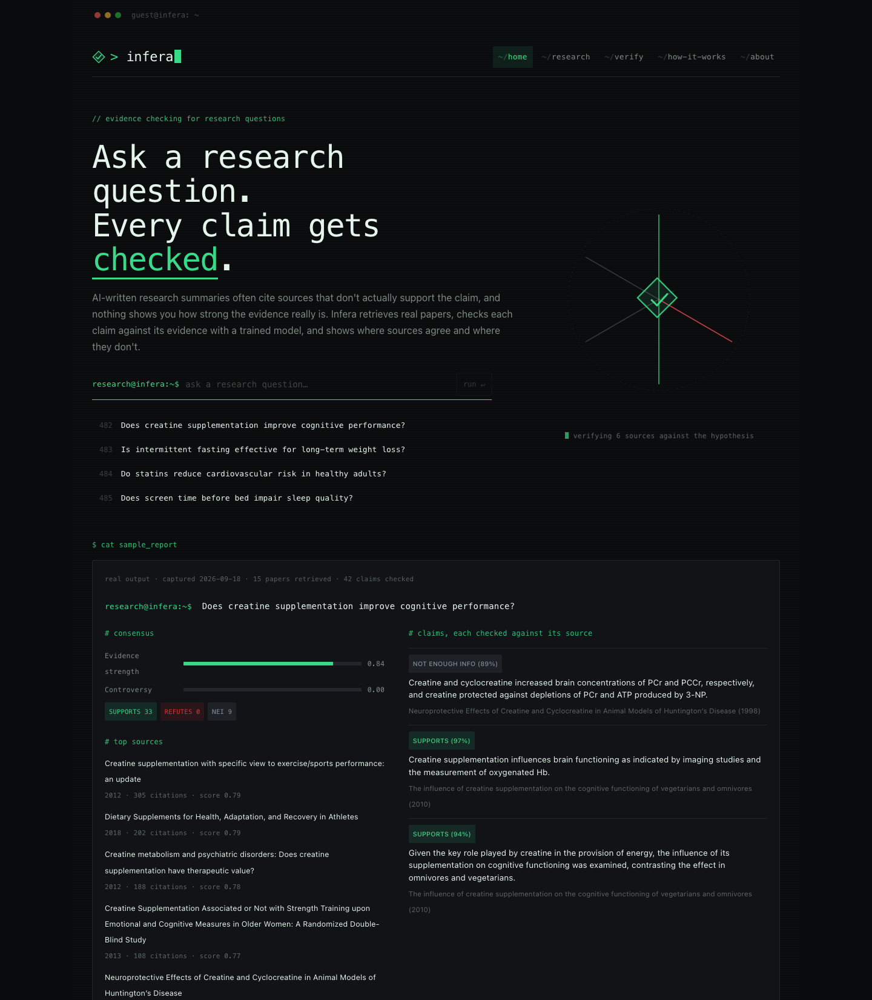
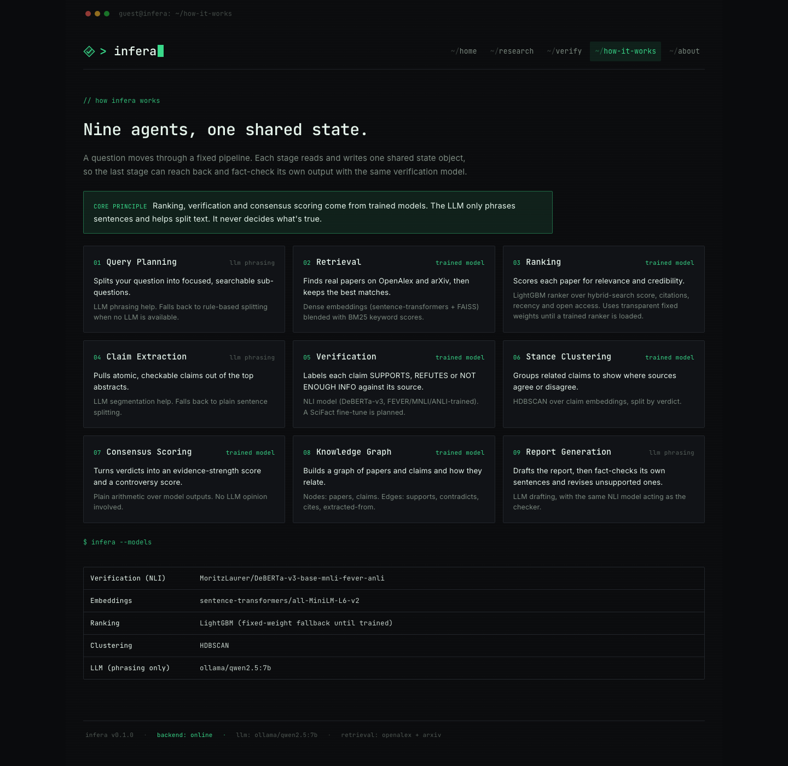
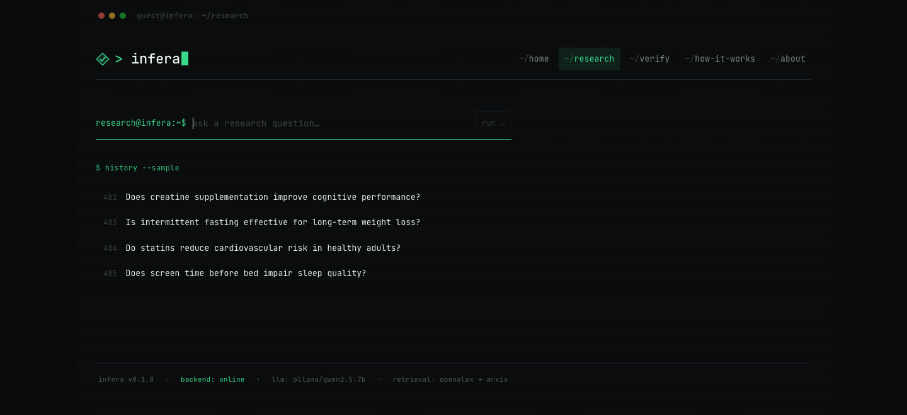
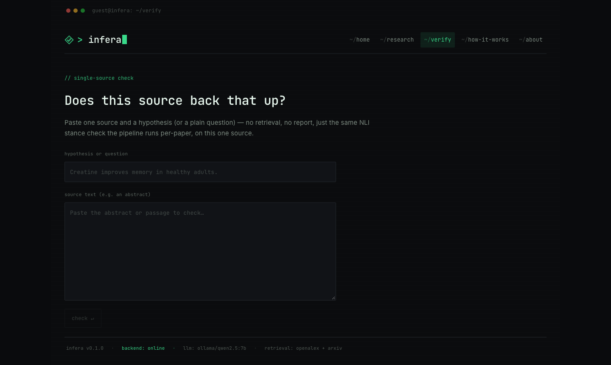

# Infera

Multi-agent research platform. A user asks a research question; Infera runs it
through a fixed pipeline of agents — each backed by a trained model where the
task calls for judgment, and an LLM only where the task is pure language
(phrasing, segmentation) — and returns a consensus-scored report with a
supporting/contradicting evidence graph.

## Screenshots

**Home — a real captured report output**


**Pipeline overview**


**Ask a research question**


**Single-source check — verify one pasted source against a hypothesis, no retrieval needed**


## Pipeline

```
Query Planning        → splits the question into sub-questions (LLM-assisted, rule-based fallback)
Retrieval              → hybrid dense (sentence-transformers + FAISS) + sparse (BM25) search
                          over papers pulled live from OpenAlex + arXiv
Ranking                → LightGBM-learned relevance/credibility score over hybrid-search +
                          citation-graph metadata features
Claim Extraction       → atomic claims pulled from top-ranked abstracts (LLM segmentation help)
Verification           → NLI model labels each claim SUPPORTS / REFUTES / NOT_ENOUGH_INFO
                          against its source (SciFact-trainable; see backend/training/train_nli.py)
Stance Clustering      → HDBSCAN over claim embeddings, split by verdict, to surface where
                          sources actually agree/disagree
Consensus/Controversy  → arithmetic aggregation of verdicts per sub-question into an
                          evidence-strength score and a controversy score
Knowledge Graph Builder→ paper + claim nodes; supports / contradicts / cites / extracted_from edges
Report Generation      → LLM drafts prose grounded in the consensus data, then re-runs the
                          same NLI model against its own sentences and asks the LLM to revise
                          any sentence that comes back unsupported
```

**Core principle:** ranking, verification, and consensus scoring are decided by
trained models (a learned ranker, a fine-tuned NLI model, HDBSCAN clustering) —
never by LLM opinion. The LLM's role is scoped to report phrasing and claim
segmentation help; it never scores relevance, credibility, entailment, or
consensus.

**No fabricated data.** Training data is SciFact/FEVER (real, public
fact-verification datasets); live retrieval is real API calls to OpenAlex
and arXiv. There are no synthetic papers or invented citations anywhere in
the pipeline.

## Architecture

The orchestrator (`backend/app/orchestrator/`) is hand-built, not a graph
framework: a `ResearchState` dataclass carries every field an agent might read
or write, and `Orchestrator.run()` executes a fixed list of agent callables in
order, tracing each one. This is what lets Report Generation reach back into
Verification's own NLI model to fact-check its own draft — it's just a Python
function call, not orchestrator-level control flow.

```
backend/
  app/
    main.py              FastAPI app, POST /api/research
    config.py             env-driven settings (model names, API keys)
    orchestrator/         ResearchState + the sequential Orchestrator
    agents/                one module per pipeline stage, each a `run(state)` function
    ml/                    NLI wrapper, LightGBM ranker, HDBSCAN clustering
    services/              OpenAlex / arXiv clients, hybrid search, scoped LLM client
    models/schemas.py      pydantic models shared by the API and the pipeline
  training/
    train_nli.py           fine-tunes an NLI checkpoint on the real allenai/scifact dataset
    train_ranker.py        trains the LightGBM ranker on real judged (query, paper) data
  tests/

frontend/
  src/
    App.tsx                tabs: report / knowledge graph / sources / claims
    components/             QueryForm, PipelineTrace, ConsensusPanel, ReportView,
                             KnowledgeGraphView (Cytoscape.js), PapersPanel, ClaimsPanel
    lib/api.ts               fetch wrapper for POST /api/research
    types/api.ts              TypeScript mirror of the backend pydantic schemas
```

## Running it

### Backend

```bash
cd backend
python3 -m venv .venv && source .venv/bin/activate
pip install -r requirements.txt
cp .env.example .env   # fill in ANTHROPIC_API_KEY (optional — see below)
uvicorn app.main:app --reload --port 8001
```

Without `ANTHROPIC_API_KEY` set, Query Planning, Claim Extraction, and Report
Generation fall back to rule-based/template behavior — the ML-judgment agents
(Retrieval, Ranking, Verification, Stance Clustering, Consensus Scoring, KG
Builder) are unaffected, since they never depend on the LLM.

The NLI model and sentence-transformer embedder are loaded once at server
**startup** (not lazily on the first request) so the first real user doesn't
pay for the HuggingFace download — this means `uvicorn` takes a while to
report "Application startup complete" the first time, which is expected.
The LightGBM ranker falls back to a transparent fixed-weight linear score
until you train one with `training/train_ranker.py`.

`/api/research` is rate-limited per client IP (10 requests/hour by default —
tune with `INFERA_RATE_LIMIT_MAX_REQUESTS` / `INFERA_RATE_LIMIT_WINDOW_S`).
The limiter is in-memory, so it only enforces correctly within a single
process — see `app/rate_limit.py` if this ever needs to run as more than
one instance.

### Frontend

```bash
cd frontend
npm install
npm run dev
```

Defaults to `http://localhost:8001` for the API; override with `VITE_API_BASE`.

### Tests

```bash
cd backend
pytest
```

## Deploying

The backend **must run as a persistent process, not a serverless function** —
each query costs multiple seconds of CPU-bound model inference, and models
are loaded once at startup, which serverless cold-starts would repeat on
every invocation. A small VPS, or a PaaS that keeps a process running
(Render, Railway, Fly.io), works; the frontend build is a static site and
can go anywhere (Vercel, Netlify, S3 — anything that serves `dist/`).

Before deploying:
- Set `INFERA_ALLOWED_ORIGINS` to the frontend's real deployed origin (CORS
  defaults to `localhost:5173` for local dev and will otherwise silently
  reject the deployed frontend's requests).
- Set `VITE_API_BASE` at frontend build time to the backend's real deployed URL.
- Put `ANTHROPIC_API_KEY` (if used) and `INFERA_OPENALEX_CONTACT_EMAIL` in
  the host's secret/env config — `backend/.env` is for local dev only and is
  gitignored.
- Confirm the rate-limit defaults (`INFERA_RATE_LIMIT_MAX_REQUESTS` /
  `_WINDOW_S`) fit expected traffic; each request is compute-heavy and, with
  an LLM key set, also costs real API spend.

## Training the models

**NLI (Verification agent):** `python -m training.train_nli --output_dir ./data/scifact-nli`
fine-tunes a FEVER-pretrained checkpoint on the real `allenai/scifact` dataset
(claim + cited abstract + SUPPORT/CONTRADICT/NOINFO label). Point
`INFERA_NLI_MODEL` at the output directory once trained.

**Ranker (Ranking agent):** `python -m training.train_ranker --source csv
--input judgments.csv` trains on real graded-relevance judgments you supply
(see the script's docstring for the CSV schema). A `--source citation` mode
is also provided as a documented *weak-supervision* fallback — it derives noisy
labels from OpenAlex's citation graph and hybrid-search rank, and is
explicitly not a substitute for real judgments.

## Scope

- **Core:** consensus/controversy scoring, paper+claim knowledge graph.
- **Stretch (not implemented):** concept-level entity linking.
- **Out of scope:** research gap detection.

`cites` paper→paper edges come from OpenAlex's `referenced_works` field,
requested inline on the same search call (no extra API round-trip per
paper) and surfaced only where both the citing and cited paper are in the
current retrieved set. arXiv's Atom API has no citation graph, so
arXiv-sourced papers never appear as a `cites` edge's source.

## Why OpenAlex instead of Semantic Scholar

The original design used the Semantic Scholar Graph API. Its unauthenticated
tier turned out to be rate-limited too aggressively to be usable in practice
(every request 429'd, including retries minutes apart), and requesting a key
requires an institutional/edu email. OpenAlex is a fully open, keyless
alternative with no rate-limit wall and broader coverage — including the
biomedical/nutrition journals arXiv doesn't index — so it replaced S2 as the
second retrieval source.
